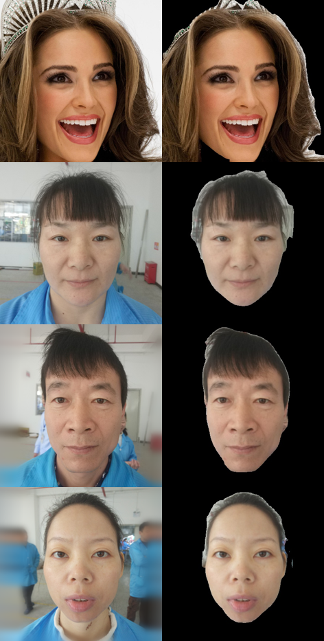

## Face_Parsing_BiseNetV2

Tensorflow Implementation of Face Parsing using BiseNetV2. BiseNetV2 using a dual branches to segment the sematic and pixel information for the image, and the inference speed is greatly improved. 

### Installation requirements

We use GPU and CPU respectively for face parsing, both of which can work normally. And all the dependence has been package to **requirements.txt**. and you can use it to recreate the environment

```shell
pip install -r requirements.txt 
```

### Inference

```python
SRC_DIR=''
DST_DIR=''
SELECT_PARTS=['skin', 'left_brow']
```

There are **three Parameters** you need to modified, **SRC_DIR**: the source path of original image which has been preprocessed by face detection and face crop ; **DST_DIR**: the destination dir of result image to save; **SELECT_PART**: which attribute you need to retain  in the result image (and the pixel of other area will be set as **BLACK**)

Before inference, we assume that you have downloaded all the model files and placed them in the correct location. [DownloadLink](https://pan.baidu.com/s/17EYCJuWmD2vtE1Z_wV6qKA) **code**: bise

```shell
python inference.py
```

### Train

In order to migrate the BiseNetV2 network in other tasks, we rebuilded the train script in tensorflow, and you also can retrain the face parsing.

All the hyperparameters can be find in **config.yaml**, and these are simple, just adjust according to your actual situation. The only one you need to pay attention is that, CelebA-HQ dataset was used  in our model train, but original data is not suitable for this train version, so we rebuild the data and place it in **CelebAMask-Manual** ,the detail of data rebuild can be find in "utils/data_reader.py".

if all the hyperparameters and data is correct, just run:

```shell
python train.py
```

**[!!!] Attention:** we used the rebuild code to retrain the face parsing model, it seems work ,but the test result is incorrect, so the code need to be test furtherly, maybe we will do it next.

### Results

The results in "face" and "hair".



